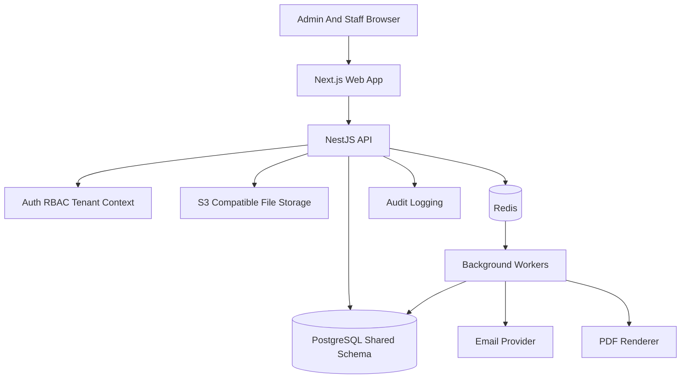

# Multi-Tenant School Management System

Greenfield foundation for a reusable SaaS school management system for Myanmar schools.

## Stack

- `apps/web`: Next.js admin UI.
- `apps/api`: NestJS API with tenant resolution, RBAC, audit foundation, and Drizzle/PostgreSQL schema.
- `apps/worker`: BullMQ worker for invoices, notifications, PDFs, imports, and exports.
- `packages/shared`: Shared product decisions, roles, permissions, modules, validation, and MVP backlog.

## First-Tenant MVP Defaults

- Salary scope: salary payment records only; staff attendance/leave salary inputs remain feature-flagged.
- LMS scope: teacher completion tracking first; student file submissions remain feature-flagged.
- Finance scope: per-student invoices with family balance grouping; family-level invoices remain feature-flagged.
- Parent portal, student portal, payment gateway, and active multi-branch operations are not part of first go-live.

## Local Setup

```bash
npm install
cp .env.example .env
docker compose up -d
npm run db:generate
npm run db:migrate
npm run db:seed
npm run dev
```

After seeding, two consoles are available:

- **Platform admin** — `http://localhost:3000/platform/login`  
  Email: `platform-admin@example.edu.mm` · Password: `ChangeMe123!`  
  Create tenants, manage school settings, and toggle feature flags.
- **School admin** — `http://localhost:3000/`  
  Use a demo tenant slug such as `demo-alpha` with `owner@demo-alpha.example.edu.mm` and the same password.
- **Demo teacher (scoping check)** — same URL, tenant `demo-alpha`, email `teacher@demo-alpha.example.edu.mm`.  
  Open **Classrooms** in the sidebar — you should see only **Grade 1 A**. The owner account sees both Grade 1 A and Grade 1 B.

## Architecture



## Tenant Isolation Rules

- Tenant-owned tables include `tenant_id`.
- API request handling must resolve tenant context before domain logic executes.
- Permission checks are performed in the API, not only in the UI.
- Sensitive student, finance, attendance, grading, discount, report-card, and support-access changes must create audit events.
- Files must be stored under tenant-scoped paths and served through signed URLs or controlled download endpoints.
